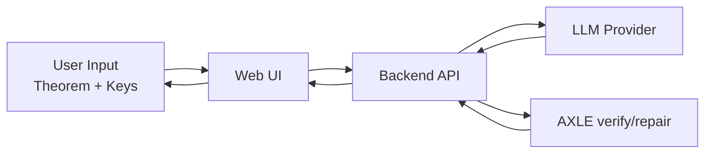

# AXLE + LLM Demo (Lean Auto-Prover)

Lean 정리를 입력하면, LLM이 증명 후보를 만들고 AXLE가 검증/수정하며 반복하는 데모 플랫폼입니다.

## 1) 플랫폼 설명

이 프로젝트는 "자연어/코딩형 생성(LLM)"과 "형식 검증(AXLE + Lean)"을 분리해 결합합니다.

- LLM: 증명 초안을 빠르게 생성
- AXLE: `verify_proof`, `repair_proofs`로 정합성 검증/수정
- Lean 환경: 최종적으로 증명 가능 여부를 엄격하게 판정

## 2) 왜 LLM + AXLE 조합인가

- LLM만 쓰면 그럴듯하지만 틀린 증명이 섞일 수 있습니다.
- 검증기만 쓰면 탐색 비용이 큽니다.
- 조합하면 "빠른 생성 + 엄격한 검증"이 동시에 됩니다.

## 3) LLM과 어떻게 상호작용하나

실행 루프:

1. LLM이 현재 목표에 대한 Lean 후보 증명 생성
2. AXLE `verify_proof` 호출
3. 실패 시 AXLE 에러를 다음 프롬프트에 전달
4. 옵션으로 AXLE `repair_proofs` 수행 후 재검증
5. 성공하거나 최대 시도 수 도달 시 종료

아키텍처:



## 4) 사이트 페이지 설명서

배포 주소:

- https://lean-beryl.vercel.app
- https://imds.sogang.ac.kr/imds/

사용 순서:

1. `OpenRouter API Key` 입력 후 `키 승인하기`
2. `AXLE API Key` 입력 후 `키 승인하기`
3. Model 선택
4. `Formal Statement`에 Lean 정리 입력 (`sorry` 포함 가능)
5. `자동 증명 시작`
6. 우측 패널에서 Attempt별 `LLM Candidate`, `Verify`, `Repair`, `Feedback` 확인

결과 읽는 법:

- `verify 통과`: 해당 후보가 Lean 검증 통과
- `repair 변경 있음`: AXLE가 코드를 수정함
- `최종 Lean Proof`: 최종 채택된 증명 코드

## 5) 페이지 스크린샷 예시

데스크톱:


모바일 폭:


## 6) 증명 예시 요약

- Singleton bound 핵심 산술형
- Hamming bound 마지막 산술 단계
- 세제곱 합 항등식

상세는 [PROOFS.md](./PROOFS.md) 참고.

## 7) 로컬 실행

```bash
/opt/homebrew/bin/python3.11 -m venv .venv
source .venv/bin/activate
pip install -r requirements.txt
python web_prover.py --host 127.0.0.1 --port 8787
```

브라우저:

- `http://127.0.0.1:8787`

## 8) 핵심 파일

- `index.html` : 단일 페이지 UI
- `app.js` : 키 승인/실행/타임라인 렌더링
- `styles.css` : 화면 스타일
- `web_prover.py` : 로컬 백엔드
- `api/index.py` : Vercel 서버리스 엔드포인트
- `autoprove.py` : 증명 루프 공통 로직
- `vercel.json` : 배포 라우팅

## 9) 보안 가이드

- 실제 키를 코드/README에 넣지 않습니다.
- `.env`, `.vercel`, `.venv`, `outputs`는 Git 추적 제외합니다.
- 키가 노출되면 즉시 rotate(폐기/재발급)합니다.
